# LangGraph Visualization

> **TL;DR**: Visualize your workflow structure to understand, debug, and share your agent architectures.

## Why Visualize?

Visualization helps you:

- **Understand** complex workflows at a glance
- **Debug** routing and flow issues
- **Document** your agent architecture
- **Communicate** designs to your team
- **Validate** workflow structure before execution

---

## Basic Visualization

### Get Mermaid Diagram

LangGraph can generate Mermaid diagrams:

```python
import mahsm as ma
from typing import TypedDict

class State(TypedDict):
    question: str
    answer: str

workflow = ma.graph.StateGraph(State)
workflow.add_node("qa", qa_func)
workflow.add_edge(ma.START, "qa")
workflow.add_edge("qa", ma.END)

# Compile
graph = workflow.compile()

# Get Mermaid diagram
diagram = graph.get_graph().draw_mermaid()
print(diagram)
```

**Output:**
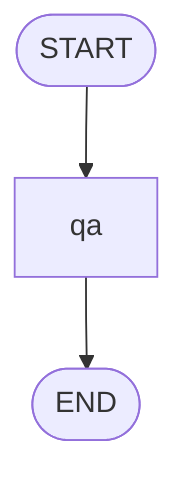

### View in Jupyter

Display in notebooks:

```python
from IPython.display import display, Markdown

# Get diagram
diagram = graph.get_graph().draw_mermaid()

# Display
display(Markdown(f"```mermaid\n{diagram}\n```"))
```

### Save to File

Save diagram for documentation:

```python
diagram = graph.get_graph().draw_mermaid()

with open("workflow.mmd", "w") as f:
    f.write(diagram)

# Or save as markdown
with open("workflow.md", "w") as f:
    f.write(f"# Workflow Diagram\n\n```mermaid\n{diagram}\n```")
```

---

## Complete Example

```python
import mahsm as ma
from typing import TypedDict, Optional
import dspy
import os

# Configure
lm = dspy.LM('openai/gpt-4o-mini', api_key=os.getenv("OPENAI_API_KEY"))
dspy.configure(lm=lm)

# State
class AgentState(TypedDict):
    question: str
    category: Optional[str]
    answer: Optional[str]
    quality_score: Optional[float]

# Nodes
def categorize(state):
    if "code" in state["question"].lower():
        return {"category": "programming"}
    return {"category": "general"}

@ma.dspy_node
class ProgrammingQA(ma.Module):
    def __init__(self):
        super().__init__()
        self.qa = dspy.ChainOfThought("question -> answer")
    
    def forward(self, question):
        return self.qa(question=question)

@ma.dspy_node
class GeneralQA(ma.Module):
    def __init__(self):
        super().__init__()
        self.qa = dspy.Predict("question -> answer")
    
    def forward(self, question):
        return self.qa(question=question)

@ma.dspy_node
class QualityCheck(ma.Module):
    def __init__(self):
        super().__init__()
        self.check = dspy.Predict("answer -> quality_score: float 0-1")
    
    def forward(self, answer):
        return self.check(answer=answer)

# Routing
def route_by_category(state):
    if state["category"] == "programming":
        return "programming_qa"
    return "general_qa"

def should_retry(state):
    if float(state.get("quality_score", 0)) < 0.7:
        return "categorize"  # Retry
    return ma.END

# Build workflow
workflow = ma.graph.StateGraph(AgentState)

workflow.add_node("categorize", categorize)
workflow.add_node("programming_qa", ProgrammingQA())
workflow.add_node("general_qa", GeneralQA())
workflow.add_node("quality_check", QualityCheck())

workflow.add_edge(ma.START, "categorize")
workflow.add_conditional_edges("categorize", route_by_category)
workflow.add_edge("programming_qa", "quality_check")
workflow.add_edge("general_qa", "quality_check")
workflow.add_conditional_edges("quality_check", should_retry)

# Compile
graph = workflow.compile()

# Visualize
diagram = graph.get_graph().draw_mermaid()
print(diagram)
```

**Output:**
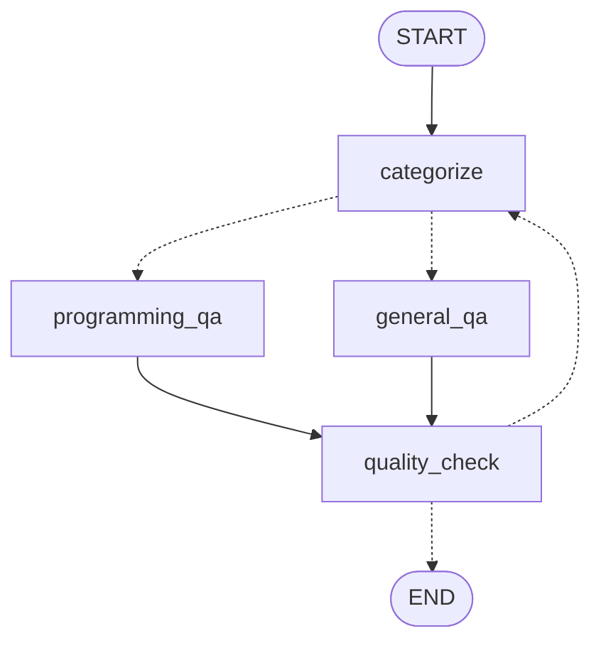

**Key:** Solid lines (→) are normal edges, dashed lines (-.→) are conditional edges.

---

## Visualization Tools

### Online Mermaid Editors

View and edit diagrams:

1. **[Mermaid Live Editor](https://mermaid.live/)** - Official editor
2. **[Mermaid Chart](https://www.mermaidchart.com/)** - Advanced features
3. **GitHub** - Renders Mermaid in markdown files

### IDE Support

Many IDEs support Mermaid:

- **VS Code** - Markdown Preview Mermaid Support extension
- **PyCharm** - Mermaid plugin
- **Obsidian** - Built-in support
- **Notion** - Code block with "mermaid" language

### Generate Images

Convert to PNG/SVG:

```bash
# Install mermaid-cli
npm install -g @mermaid-js/mermaid-cli

# Convert to PNG
mmdc -i workflow.mmd -o workflow.png

# Convert to SVG
mmdc -i workflow.mmd -o workflow.svg
```

---

## Understanding Diagrams

### Node Types

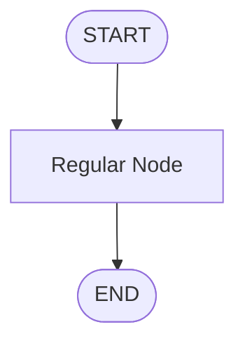

- **Rounded boxes** `([...])`: START/END
- **Rectangles** `[...]`: Regular nodes

### Edge Types

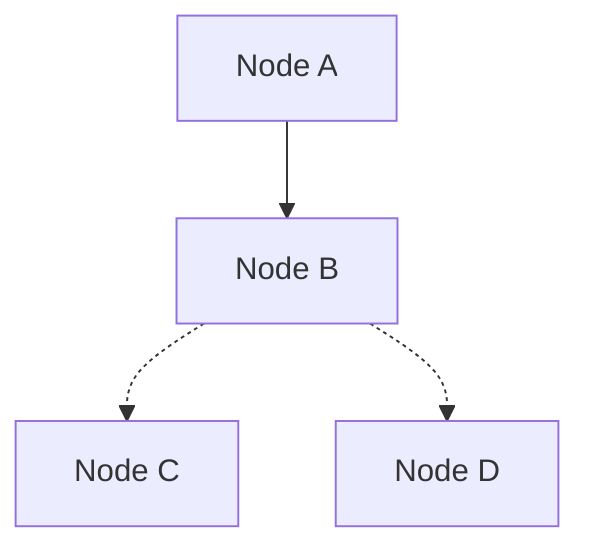

- **Solid arrow** `-->`: Normal edge (always follows)
- **Dashed arrow** `-.->`: Conditional edge (depends on state)

### Complex Flows

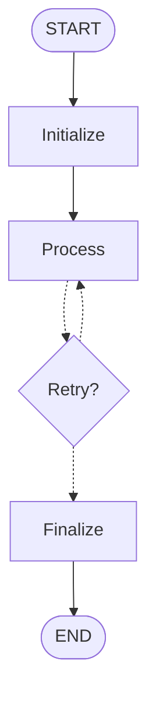

Shows loops and branching clearly.

---

## Debugging with Visualization

### Identify Issues

Common problems visualizations reveal:

**1. Unreachable Nodes**
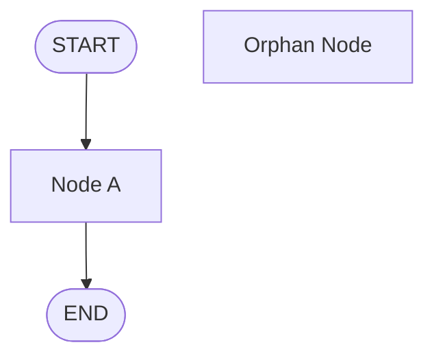
*Node B is never reached!*

**2. Missing Exit**
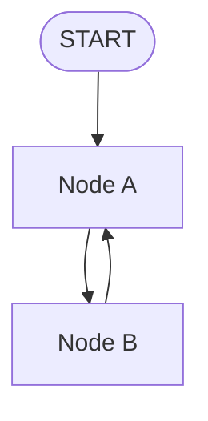
*Infinite loop - no path to END!*

**3. Overly Complex Routing**
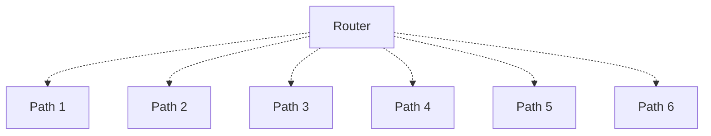
*Too many branches - consider simplifying*

### Validation Checklist

Use visualization to check:

- [ ] Every node is reachable from START
- [ ] There's at least one path to END
- [ ] Conditional edges have all possible outcomes
- [ ] No unnecessary complexity
- [ ] Clear, logical flow

---

## Documentation Best Practices

### 1. Embed in README

```markdown
# My Agent

## Architecture

```mermaid
graph TD
    START([START]) --> classify[Classify Question]
    classify -.-> simple[Simple QA]
    classify -.-> complex[Complex QA]
    simple --> END([END])
    complex --> END
\```

## How It Works

1. **Classify**: Determines question complexity
2. **Simple QA**: Fast path for easy questions
3. **Complex QA**: Deep analysis for hard questions
```

### 2. Version Control

Track architecture changes:

```bash
# Save diagram with version
git add workflow-v1.0.mmd
git commit -m "feat: Initial workflow design"

# Later, after changes
git add workflow-v2.0.mmd
git commit -m "feat: Added retry logic"
```

### 3. Team Communication

Share diagrams in:
- **Pull requests** - Show what changed
- **Design docs** - Illustrate proposals
- **Onboarding** - Help new team members understand
- **Meetings** - Discuss architecture visually

---

## Advanced: Custom Styling

Customize Mermaid diagrams:

```python
diagram = graph.get_graph().draw_mermaid()

# Add custom styling
styled_diagram = f"""
%%{{init: {{'theme':'dark', 'themeVariables': {{'primaryColor':'#6366f1'}}}}}}%%
{diagram}
"""

print(styled_diagram)
```

### Themes

Available themes:
- `default` - Light theme
- `dark` - Dark theme
- `forest` - Green theme
- `neutral` - Grayscale

### Example with Styling

```markdown
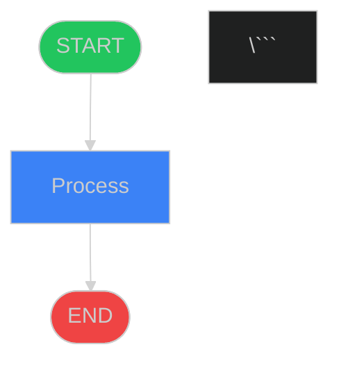

---

## Integration with Langfuse

Combine visualization with tracing:

```python
import mahsm as ma

# Initialize tracing
ma.tracing.init()

# Build and compile
graph = workflow.compile()

# Save diagram for reference
diagram = graph.get_graph().draw_mermaid()
with open("docs/architecture.md", "w") as f:
    f.write(f"# Agent Architecture\n\n```mermaid\n{diagram}\n```")

# Run with tracing
result = graph.invoke({"question": "Test"})

# Now you can:
# 1. View structure in architecture.md
# 2. View actual execution in Langfuse UI
# 3. Compare expected vs actual flow
```

---

## Comparing Workflows

### Before Optimization

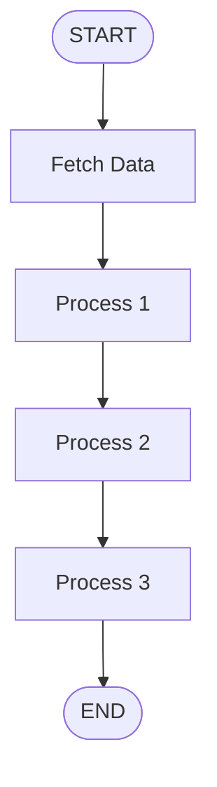

### After Optimization

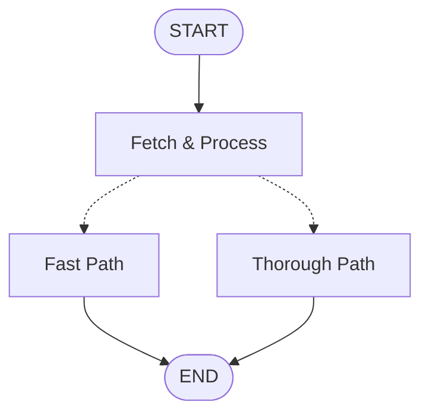

*Simplified and added conditional routing*

---

## Real-World Examples

### Research Agent

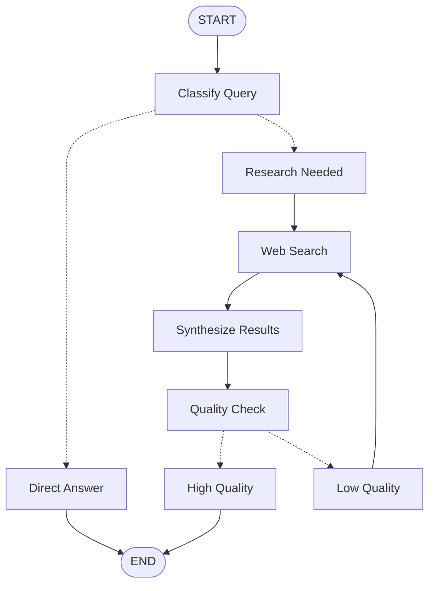

### Code Generation Agent

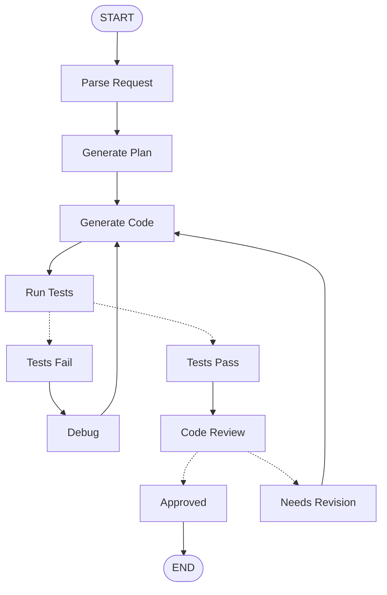

### Customer Support Agent

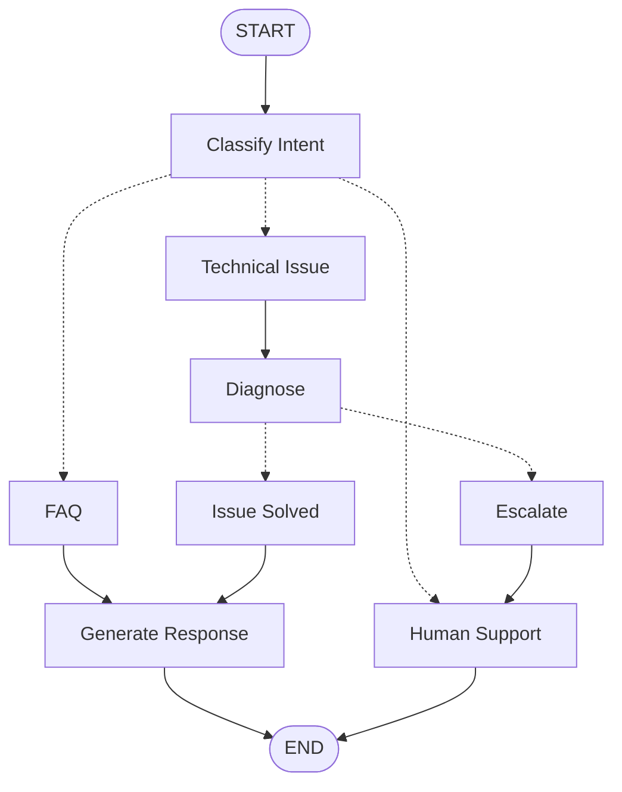

---

## Best Practices

### ✅ Do:

1. **Visualize before implementation** - Catch design issues early
2. **Keep diagrams updated** - Reflect actual implementation
3. **Use meaningful node names** - Make diagrams self-documenting
4. **Simplify complex flows** - If diagram is confusing, workflow probably is too
5. **Version control diagrams** - Track architecture evolution

### ❌ Don't:

1. **Let diagrams get stale** - Update when workflow changes
2. **Over-complicate** - If visualization is a mess, simplify workflow
3. **Skip validation** - Use diagrams to spot structural issues
4. **Forget to share** - Diagrams are for communication

---

## Next Steps

- **[Build Your First Agent](../../guides/first-agent.md)** → Put it all together
- **[LangGraph Overview](overview.md)** → Review concepts
- **[Examples](../../examples/)** → See complete projects

---

## External Resources

- **[Mermaid Documentation](https://mermaid.js.org/)** - Full Mermaid guide
- **[Mermaid Live Editor](https://mermaid.live/)** - Test diagrams online
- **[LangGraph Examples](https://langchain-ai.github.io/langgraph/tutorials/)** - Official examples

---

**Congratulations!** 🎉 You've completed the LangGraph Building Blocks section. Ready to build your first agent? **[Get Started →](../../guides/first-agent.md)**
